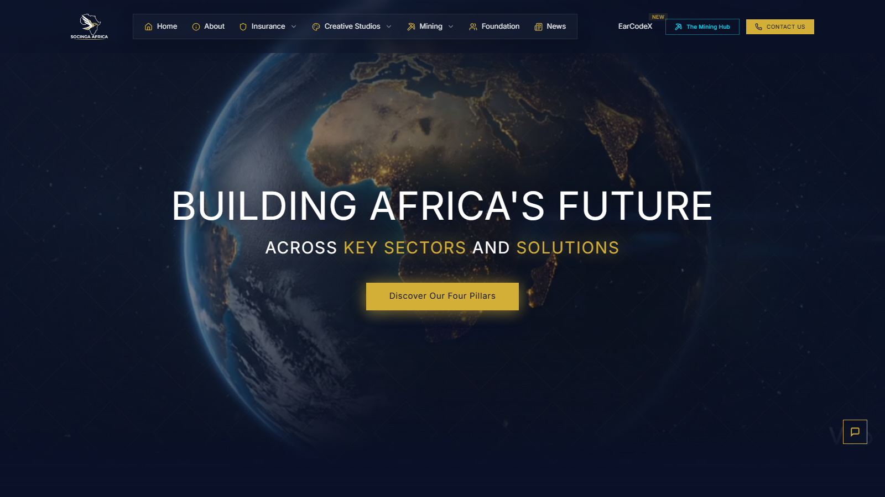

# Socinga Africa Enterprise Website - Portfolio Case Study

**Live artifact:** [https://www.socinga.africa/](https://www.socinga.africa/)  
**Portfolio role:** Enterprise digital platform, public-facing systems architecture, cross-border stakeholder communication  
**Source posture:** Sanitized public case study with production implementation kept controlled.

_Generated portfolio visual; not a confidential product screenshot._

_Public live artifact screenshot captured on June 4, 2026._

## Overview

Socinga Africa is a public enterprise website spanning insurance, creative studios, mining, foundation, news, and EarCodeX positioning.

## My Role

I contributed to the digital platform structure, public-facing content architecture, regulated-sector positioning, and systems thinking behind a multi-division enterprise web presence.

## What This Demonstrates

- Enterprise information architecture across multiple business divisions.
- Public-facing content systems for credibility, stakeholder review, and market communication.
- Regulated-sector positioning across insurance, investment, mining, media, and social-impact work.

## Technical Proof

- **Stack and delivery signals:** Enterprise information architecture, multi-division content structure, regulated-sector positioning, and public stakeholder communication.
- **Public evidence:** Live site divisions, news surface, stakeholder-facing sections, and architecture explanation without operational exposure.
- **Confidentiality boundary:** This public repo avoids credentials, private operations, client data, infrastructure detail, internal workflows, and non-public operational documents.

## Public Review Context

The live artifact presents the public user experience. This case study adds role, architecture, and systems-positioning context. The [NWhite Systems Portfolio](https://github.com/whitemorengwira/nwhitesystems) and [one-page recruiter PDF](https://github.com/whitemorengwira/nwhitesystems/blob/main/docs/assets/recruiter-pack/Whitemore-Ngwira-Selected-Systems-Portfolio.pdf) provide broader hiring-review context.

## 90-Second Evidence Route

- Live enterprise site for the public user experience.
- `My Role`, `What This Demonstrates`, and `Technical Proof` for role and delivery evidence.
- Wider [recruiter review guide](https://github.com/whitemorengwira/nwhitesystems/blob/main/docs/recruiter-review-guide.md) for portfolio context.
- [Portfolio walkthrough request](mailto:hello@nwhite.systems?subject=Portfolio%20walkthrough%20-%20Socinga%20Africa%20Enterprise) for deeper review where confidentiality allows.

## Confidentiality

This repository does not publish credentials, private operations, client data, infrastructure detail, internal enterprise workflows, or non-public operational documents. Deeper walkthroughs can be provided privately where confidentiality allows.

## Usage Rights

This repository is public for portfolio review only and is not open-source licensed. See [COPYRIGHT.md](COPYRIGHT.md) for usage boundaries.

## Request Walkthrough

Private walkthroughs are available where permissions allow: [hello@nwhite.systems](mailto:hello@nwhite.systems?subject=Portfolio%20walkthrough%20-%20Socinga%20Africa%20Enterprise)
